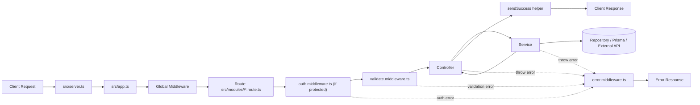

# SRLP Backend KT Guide (Junior / Intern Friendly)

This guide explains the project in simple language:
- which folder is used for what
- why each layer exists
- how request flow works
- how generic helpers (`asyncHandler`, `ApiError`, `sendSuccess`) work together
- how testing works in this repo
- how to safely add a new file/module without breaking flow

---

## 1) Big Picture: How Backend Works

Think of backend as a pipeline:

1. Client sends request.
2. `app.ts` routes request to correct module.
3. Middleware checks/cleans/validates request.
4. Controller receives valid request and calls service.
5. Service runs business logic and DB/external operations.
6. Controller sends success response.
7. If any error happens, global error middleware sends error response.

### Diagram (Request Flow)



---

## 2) Folder-by-Folder Explanation (What + Why)

### `src/server.ts`
- Starts Express app.
- Handles critical process-level crashes (`uncaughtException`, `unhandledRejection`).
- Why needed: safe startup/shutdown behavior.

### `src/app.ts`
- Main wiring file.
- Registers global middleware and module routes (`/api/auth`, `/api/ai`).
- Why needed: one central entry for app composition.

### `src/modules/<feature>/`
- Feature-specific implementation.
- Typical files:
  - `*.route.ts`
  - `*.validation.ts`
  - `*.controller.ts`
  - `*.service.ts`
  - `*.repository.ts` (optional)
- Why needed: keeps each business feature isolated and maintainable.

### `src/middlewares/`
- Request-level cross-cutting logic.
- Examples:
  - `validate.middleware.ts`: validates request using Zod.
  - `error.middleware.ts`: catches and formats errors globally.
- Why needed: reuse common request logic across all modules.

### `src/utils/`
- Generic reusable utilities.
- Example: `asyncHandler.ts`.
- Why needed: avoid repeating try/catch boilerplate in every controller.

### `src/shared/helpers/`
- Common response and error helpers:
  - `ApiError.ts`
  - `response.ts` (`sendSuccess`)
- Why needed: enforce consistent API output style.

### `src/security/`
- Security-specific logic:
  - `password.service.ts` (bcrypt hash/compare)
  - `jwt.service.ts` (sign/verify JWT)
- Why needed: isolate sensitive auth logic in one trusted place.

### `src/monitoring/`
- Logging and tracing:
  - `logger.ts`: configures how logs are written (files/levels).
  - `request.logger.ts`: middleware for request ID + request timing logs.
- Why needed: observability and debugging.

### `src/constants/`
- Central place for messages, limits, fixed values.
- Why needed: avoid hardcoded strings scattered in code.

### `prisma/`
- `schema.prisma` + migrations.
- Why needed: database model and change history.

### `tests/`
- Automated test files.
- Why needed: prevent regressions when code changes.

---

## 3) Why `asyncHandler` Exists (Simple)

Without `asyncHandler`, each controller needs repetitive try/catch:

- call service
- catch error
- call `next(error)`

`asyncHandler` wraps async controllers and automatically forwards errors to `error.middleware.ts`.

So controller code stays clean and focused on:
- reading request
- calling service
- sending response

---

## 4) Why `ApiError` in Service and `sendSuccess` in Controller?

This is intentional separation of responsibilities:

- **Service layer** decides business outcomes.
  - If failure: throw `ApiError` (for example bad request, not found, forbidden).
- **Controller layer** handles HTTP response writing.
  - If success: call `sendSuccess(...)`.

Why this is good:
- Services stay reusable and testable (not tied to Express response object).
- Controllers remain thin and consistent.
- Error handling is centralized in one middleware.

---

## 5) Middleware Order and Difference

Typical order:

1. request id / request logger middleware (global)
2. parser middleware (`express.json`, etc.)
3. route-specific validation middleware (`validateBody`)
4. controller
5. error middleware (runs when any layer throws)

Difference between key middlewares:

- `validate.middleware.ts`
  - validates input shape and values before controller/service runs.
  - returns clear 400 error for bad inputs.

- `error.middleware.ts`
  - catches thrown errors from validation/controller/service.
  - normalizes error response shape.

---

## 6) `service.ts` vs `repository.ts` (Important)

### `service.ts`
- Business rules and orchestration.
- Calls repository/Prisma/external APIs.
- Logs significant events.
- Throws `ApiError` on failure.
- Returns `{ message, data }`.

### `repository.ts` (optional)
- Pure DB query helpers (Prisma queries).
- No HTTP concerns.
- No response formatting.
- No controller imports.

Use repository when queries become complex/reused across services.

---

## 7) Monitoring: `logger.ts` vs `request.logger.ts`

### `logger.ts`
- Core logger configuration (transport, level, format).
- Think: "how and where logs are written."

### `request.logger.ts`
- Middleware that logs each request lifecycle.
- Adds/propagates request ID (`X-Request-Id`) and duration.
- Think: "what request happened and how long it took."

Both work together:
- `request.logger.ts` produces request logs
- `logger.ts` writes them to configured log outputs

---

## 8) Testing in This Project (What We Use)

This project uses:
- **Vitest** for unit testing (`vitest` package)

Current tests are in:
- `tests/security/password.service.test.ts`
- `tests/security/jwt.service.test.ts`

That means:
- yes, we are doing **automated unit testing**
- currently only foundational security tests are added

### Angular comparison (your example)

In Angular, people often use:
- Jasmine + Karma + TestBed

In this backend, we use:
- Vitest + Node-style module tests (no Karma browser runner)

### How to add test for new file

If new file is `src/modules/product/product.service.ts`, create:
- `tests/product/product.service.test.ts`

Test at least:
1. success path
2. failure path
3. edge case path

Run all checks:
- `npm test`

---

## 9) If You Add a New Module (Safe Checklist)

1. Create module files under `src/modules/product/`.
2. Add constants/messages.
3. Add Zod validation schema and types.
4. Write service logic.
5. Write controller using `asyncHandler` + `sendSuccess`.
6. Wire route with validation middleware.
7. Register route in `app.ts`.
8. Add tests in `tests/product/`.
9. Run `npm test`.

---

## 10) Common Mistakes to Avoid

- Putting business logic inside controller.
- Returning response directly from service (`res.status(...)` in service).
- Hardcoding error/success messages everywhere.
- Skipping validation middleware.
- Logging secrets/passwords/tokens.
- Writing zero tests for new service behavior.

---

## 11) Suggested Prompt You Can Reuse (For Better AI Help)

Use this prompt when asking for changes:

```text
Act as a senior backend engineer and explain for a junior developer.

Task:
- [describe task]

Requirements:
- Follow existing architecture (route -> validation -> controller -> service -> repository optional)
- Keep controller thin
- Keep service business-focused
- Use shared helpers (ApiError/sendSuccess/asyncHandler) correctly
- Use constants for messages
- Add/update tests for changed logic

Output format:
1) What will change and why
2) File-by-file changes
3) Request flow diagram
4) Test plan (unit + edge cases)
5) Risks and backward compatibility notes
```

Tip: If you are unsure, ask AI to first "explain existing flow in simple terms before coding."
